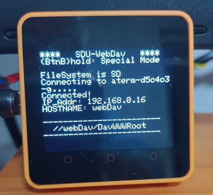
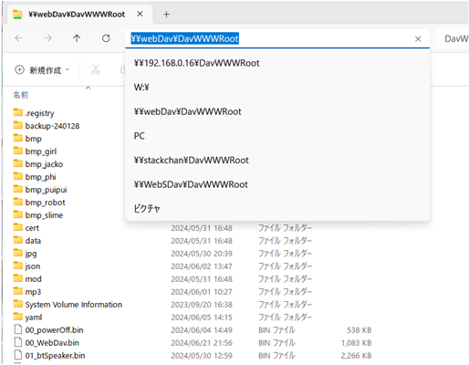
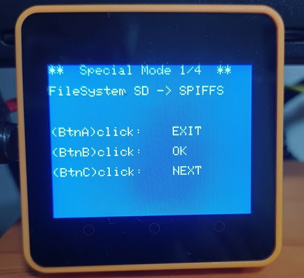

# SDU-WebDav

SD-Updaterに対応したファイル管理（WebDav）ツールです。 
PC等から直接、M5Stack Core2のSD/SPIFFSにアクセスすることができるようになります。 

<b>（※注意）</b> 
本ソフトウエア使用により、ファイル等の破損などで損害が発生しても責任を取ることができません。
ご了承の上、ご利用ください。 
 

## 設定ファイル
設定サンプルを変更してSD直下にコピーしてください。 
  
- wifi.txt 
  WiFi設定のファイル 
  １行目：SSID 
  ２行目：SSIDのPASSWD 

   

## 対応ハードウエア
### 本体:　 M5Stack Core2
- M5Stack Core2 for AWS（動作確認している機種） 
- M5Stack Core2  
- M5Stack Core2 v1.1　 
 

### SD:　 FAT32 format
SDは、相性等（？）で、動作が不安定になるものがありますので注意が必要です。</b> 
  

## 使用方法
### 電源投入
電源投入直後のブート時に SD-UpdaterのLobby画面が現れます。 
その後、ソフトが立ち上がり、wifi等の設定が完了しますと接続情報が画面に表示されます。 
画像から、FileSystemは、SDを選択されていることが確認できます。（初期値）  
  

 

### PCからのアクセス
PCは、win11での説明です。 
win11のOS標準のファイル・エクスプローラーを使用します。 
画面上部の位置を入力箇所に、全て半角文字で 
 - <b>"￥￥webDav￥DavWWWRoot"</b>　と入力してください。  

または、webDav(HOSTNAME)の代わりに、<b>IPアドレス</b>を入れることもできます。 
 - <b>(例)　"￥￥192.168.0.16￥DavWWWRoot"</b>

  
 

接続が完了しますと、ファイル・エクスプローラーで本体(5StackCore2)のSDまたは、SPIFFSのファイルを操作することができるようになります。  

 - 画面にショートカットを作成するとアクセスが簡単になります。 

 - デスクトップの「PC」アイコンを右クリックし、ネットワークドライブの割り当てで使用することもできます。 

 - スマホ(Android/iPhone)やPC(Mac/Linuex)等でもWebDavは、接続できるようです。 
 （未確認） 
  

  

### Special Mode : (BtnB)の長押し 
Special Modeの画面になり、FileSystemの変更(SD <-> SPIFFS)等ができます。 
 
 
FileSystemが変更されますと、一度リブートします。 
その後、変更後のFileSystemが有効になります。 

  

## 参照情報
以下の情報を参照しました。 

ESPWebDAVライブラリ 
https://github.com/d-a-v/ESPWebDAV 

たなかまさゆき さん(@tnkmasayuki) 
https://lang-ship.com/blog/work/esp32-webdav/ 

リナちゃん@chrmlinux03 
https://qiita.com/chrmlinux03/items/5d65893760dad6f4bee0 

このソフトのGitHub 
https://github.com/NoRi-230401/SDU-WebDav 

   